# Galaxy S7 Homelab: Zero-Cost Infrastructure on Mobile Hardware

## 🎯 The Story: IT Support Skills in Action

After completing my **Google IT Support Certificate**, I faced a challenge: how do I demonstrate practical skills without expensive hardware? My previous homelab ran on an old PC that died, leaving me with only my main computer and an **old Samsung Galaxy S7**.

**The Problem:**
- No budget for servers or cloud services (free-tier only)
- A single PC couldn't be dedicated as a server
- Needed hands-on experience with real IT infrastructure

**The Solution:**
Most Android phones run on a **Linux kernel** - why not use one as a server? Instead of rooting or custom ROMs (which had compatibility issues), I built a complete homelab infrastructure directly on the Galaxy S7 using only **open-source and free-tier tools**.

**The Result:**
A fully functional IT environment running monitoring, automation, security auditing, and hosting my [personal resume website](https://saintlex.sbs) - all from a retired smartphone.

## 📱 Technical Overview

- **Hardware**: Samsung Galaxy S7 (Exynos 8890, 4GB RAM)
- **Platform**: Android → Linux via Termux/UserLAnd
- **Constraints**: No root access, ARM architecture, limited storage
- **Services**: 8,070 files across 1,236 directories
- **Cost**: $0 (all open-source/free-tier)

## 🏗️ System Architecture



```mermaid
flowchart TD
    A[<b>Homelab Root Directory</b>] --> B[<b>Audit & Security</b>]
    A --> C[<b>Automation & Scripts</b>]
    A --> D[<b>Core Services</b>]
    A --> E[<b>Backup & Recovery</b>]
    A --> F[<b>Monitoring</b>]
    A --> G[<b>Networking & Access</b>]
    A --> H[<b>Documentation & Logs</b>]
    
    %% Audit & Security
    B --> B1[Audit Reports<br/>20251213-20251219]
    B --> B2[Security Scans<br/>& Logs]
    B --> B3[Configuration Files]
    
    %% Automation & Scripts
    C --> C1[Ansible Playbooks]
    C --> C2[Shell Scripts<br/>40+ automation files]
    C --> C3[Python Utilities]
    
    %% Core Services
    D --> D1[Docker Homelab<br/>Grafana+Prometheus]
    D --> D2[Web Content<br/>index.html + info.php]
    D --> D3[PHP Debug Tools]
    
    %% Backup & Recovery
    E --> E1[SQL Backups]
    E --> E2[Shell Backup Scripts]
    E --> E3[Python Restore Tools]
    E --> E4[Encrypted Backups]
    
    %% Monitoring
    F --> F1[Uptime Kuma<br/>Full Application]
    F --> F2[Service Health Scripts]
    F --> F3[Port Checkers]
    
    %% Networking & Access
    G --> G1[Cloudflare Tunnels]
    G --> G2[DNS & SSL Setup]
    G --> G3[Certificate Management]
    G --> G4[Oracle Cloud Keys]
    
    %% Documentation & Logs
    H --> H1[README & Guides]
    H --> H2[Command History]
    H --> H3[Scan Results<br/>20251215-20251218]
    H --> H4[Reorganization Logs]
    
    %% Logical Flow
    C1 -->|Deploys| D1
    C2 -->|Manages| G1
    F1 -->|Monitors| D1
    F1 -->|Monitors| G1
    E2 -->|Creates| E1
    E3 -->|Restores| E1
    B2 -->|Feeds Into| H3
    G1 -->|Provides Access To| D2
    
    style A fill:#2ecc71,stroke:#27ae60
    style B fill:#3498db,stroke:#2980b9
    style C fill:#9b59b6,stroke:#8e44ad
    style D fill:#e74c3c,stroke:#c0392b
    style E fill:#f39c12,stroke:#d35400
    style F fill:#1abc9c,stroke:#16a085
    style G fill:#34495e,stroke:#2c3e50
    style H fill:#95a5a6,stroke:#7f8c8d;
```

🔧 Core Technologies & Skills Demonstrated
Infrastructure & Automation
Ansible for configuration management

Docker containerization (adapted for ARM)

Bash scripting (40+ automation scripts)

Cloudflare Tunnels for secure external access

SSL/TLS management with Let's Encrypt

Monitoring & Observability
Uptime Kuma - Full self-hosted monitoring

Grafana & Prometheus - Metrics visualisation

Custom health checks - Bash/Python monitoring scripts

Alerting systems - Multi-channel notifications

Security & Compliance
Automated security audits - Regular vulnerability scanning

Log aggregation & analysis - Centralised logging

Encrypted backups - AES-256 encrypted offsite backups

Network security - Firewall rules, access controls

Web Development & Hosting
PHP/HTML/CSS - Custom web interfaces

Nginx reverse proxy - Service routing

DNS management - Custom domain configuration

SSL certificates - Automated renewal

📁 Project Structure Highlights
text
galaxy-s7-homelab/
├── scripts/               # 40+ automation scripts
│   ├── backup_homelab.sh           # Encrypted backup system
│   ├── cf_tunnel.sh                # Cloudflare tunnel management
│   ├── security_audit.sh           # Automated security scanning
│   └── service_monitor.sh          # Custom health checks
├── services/              # Dockerized services
│   ├── uptime-kuma/      # Full monitoring application
│   ├── grafana/          # Metrics dashboard
│   └── prometheus/       # Time-series database
├── web/                   # Website files
│   ├── index.html        # Landing page
│   └── info.php          # Dynamic content
├── audit-reports/        # Security audit history
├── backups/              # Backup configurations
└── docs/                 # Complete documentation
🚀 Getting Started (For Employers/Recruiters)
Quick Demo Access
Live Website: https://saintlex.sbs

Monitoring Dashboard: https://status.saintlex.sbs (if configured)

Source Code: This repository

Key Scripts to Review
bash
# Shows creative problem-solving within constraints
scripts/backup_homelab_fixed.sh    # Encrypted backup solution
scripts/cf_simple_setup.sh         # External access without public IP
scripts/diagnose-mismatch.sh       # Troubleshooting automation
scripts/homelab-mapper.py          # Infrastructure visualisation
💡 Innovative Solutions & Constraints Overcome
Challenge 1: No Public IP Address
Solution: Implemented Cloudflare Tunnels to expose services securely without port forwarding or public IP.

Challenge 2: Limited ARM-Compatible Software
Solution: Compiled Docker images for ARM architecture and found alternative tools that supported ARMv8.

Challenge 3: Limited Storage (32GB)
Solution: Implemented aggressive log rotation, compressed backups, and used external storage for archives.

Challenge 4: Battery-Powered Device
Solution: Configured power-saving modes while maintaining essential services, with automatic shutdown during critical battery levels.

📊 What This Demonstrates
Google IT Support Certificate Skills Applied:
✅ System Administration - Linux server management on non-traditional hardware

✅ Networking - DNS, VPNs, tunnelling, firewall configuration

✅ Security - Regular audits, encryption, access controls

✅ Troubleshooting - Diagnostic scripts and monitoring

✅ Customer Support - Documentation and user-friendly interfaces

Beyond Certificate:
Infrastructure as Code - Ansible playbooks and automation

CI/CD Mindset - Automated testing and deployment

Cloud Integration - Hybrid on-prem/cloud architecture

Cost Optimisation - Maximum value from zero budget

🔄 Maintenance & Operations
bash
# Daily operations (automated via cron)
./scripts/homelab_status.sh        # Health check
./scripts/backup_homelab.sh        # Incremental backup

# Weekly operations
./scripts/security_audit.sh        # Security scan
./scripts/update_services.sh       # Service updates

# Monthly operations
./scripts/full_audit.sh            # Comprehensive audit
./scripts/test_recovery.sh         # Disaster recovery test
🛡️ Security & Privacy Notes
Important: This repository contains sanitized configurations only. Sensitive data (API keys, passwords, personal information) has been removed or replaced with placeholders.

Security measures in production:

All external access via Cloudflare Zero Trust

Encrypted backups with offline key storage

Regular security audits and patching

Minimal exposed services

📈 Future Enhancements
Kubernetes Cluster - Add additional old Android devices

CI/CD Pipeline - Automated testing and deployment

IoT Integration - Connect smart home devices

ML Monitoring - Predictive failure analysis

📞 Contact & Resume
Live Resume: https://saintlex.sbs

Email: [Your professional email]

LinkedIn: [Your LinkedIn profile]

Certifications: Google IT Support Certificate

📄 License
This project is open-source under the MIT License - free to use for learning and inspiration.

Built with constraint-driven innovation on a Samsung Galaxy S7

text

## **Additional Files to Include:**

### **PROJECT_STORY.md** (For detailed narrative)
```markdown
# The Journey: From Google Certificate to Production Homelab

## Phase 1: The Problem (December 2024)
- Completed Google IT Support Certificate
- No hardware for practical experience
- Limited budget for cloud services

## Phase 2: The Discovery (January 2025)
- Research on Android-as-server possibilities
- Testing Termux, UserLAnd, Andronix
- Initial service deployments (NGINX, MySQL)

## Phase 3: The Build (February 2025)
- Infrastructure design within constraints
- Service selection (open-source, ARM-compatible)
- Automation scripting for reliability

## Phase 4: The Polish (March 2025)
- Security hardening
- Monitoring implementation
- Documentation creation
- Website deployment

## Lessons Learned:
1. **Constraints breed creativity** - Limited resources forced innovative solutions
2. **Documentation is debugging for humans** - Comprehensive logs saved hours
3. **Automate everything** - Manual processes fail at 3 AM
4. **Security isn't optional** - Even personal projects need protection
TECHNICAL_CHALLENGES.md
markdown
# Technical Challenges & Solutions

## 1. ARM Architecture Limitations
**Problem**: Most Docker images are built for x86_64
**Solution**: 
- Used `arm32v7` and `arm64v8` base images
- Compiled from source where necessary
- Created custom Dockerfiles for ARM

## 2. Limited RAM (4GB)
**Problem**: Memory-intensive services failing
**Solution**:
- Configured swap files on external storage
- Reduced service resource allocations
- Implemented aggressive caching

## 3. Intermittent Power
**Problem**: Phone reboots during updates
**Solution**:
- Implemented transaction-like updates
- Created resume scripts for interrupted operations
- Scheduled major changes during charging
GitHub Profile Enhancement:
Add this to your GitHub profile README:

markdown
## 🔧 Current Project: Zero-Cost Mobile Homelab

I'm running a complete IT infrastructure on a Samsung Galaxy S7 using only open-source tools. This demonstrates the practical application of my Google IT Support Certificate skills within extreme constraints.

**Features:**
- 🚀 Full monitoring stack (Uptime Kuma + Grafana)
- 🔒 Automated security auditing
- 🌐 Cloudflare tunnels for external access
- 💾 Encrypted backup system
- 📱 All on mobile hardware with zero budget


