```mermaid
flowchart TD
    A[<b>Homelab Root Directory</b>] --> B[<b>Audit & Security</b>]
    A --> C[<b>Automation & Scripts</b>]
    A --> D[<b>Core Services</b>]
    A --> E[<b>Backup & Recovery</b>]
    A --> F[<b>Monitoring</b>]
    A --> G[<b>Networking & Access</b>]
    A --> H[<b>Documentation & Logs</b>]
    
    %% Audit & Security
    B --> B1[Audit Reports<br/>20251213-20251219]
    B --> B2[Security Scans<br/>& Logs]
    B --> B3[Configuration Files]
    
    %% Automation & Scripts
    C --> C1[Ansible Playbooks]
    C --> C2[Shell Scripts<br/>40+ automation files]
    C --> C3[Python Utilities]
    
    %% Core Services
    D --> D1[Docker Homelab<br/>Grafana+Prometheus]
    D --> D2[Web Content<br/>index.html + info.php]
    D --> D3[PHP Debug Tools]
    
    %% Backup & Recovery
    E --> E1[SQL Backups]
    E --> E2[Shell Backup Scripts]
    E --> E3[Python Restore Tools]
    E --> E4[Encrypted Backups]
    
    %% Monitoring
    F --> F1[Uptime Kuma<br/>Full Application]
    F --> F2[Service Health Scripts]
    F --> F3[Port Checkers]
    
    %% Networking & Access
    G --> G1[Cloudflare Tunnels]
    G --> G2[DNS & SSL Setup]
    G --> G3[Certificate Management]
    G --> G4[Oracle Cloud Keys]
    
    %% Documentation & Logs
    H --> H1[README & Guides]
    H --> H2[Command History]
    H --> H3[Scan Results<br/>20251215-20251218]
    H --> H4[Reorganization Logs]
    
    %% Logical Flow
    C1 -->|Deploys| D1
    C2 -->|Manages| G1
    F1 -->|Monitors| D1
    F1 -->|Monitors| G1
    E2 -->|Creates| E1
    E3 -->|Restores| E1
    B2 -->|Feeds Into| H3
    G1 -->|Provides Access To| D2
    
    style A fill:#2ecc71,stroke:#27ae60
    style B fill:#3498db,stroke:#2980b9
    style C fill:#9b59b6,stroke:#8e44ad
    style D fill:#e74c3c,stroke:#c0392b
    style E fill:#f39c12,stroke:#d35400
    style F fill:#1abc9c,stroke:#16a085
    style G fill:#34495e,stroke:#2c3e50
    style H fill:#95a5a6,stroke:#7f8c8d;
```

# 📱 S7 Homelab: Turning a Smartphone into a Linux Server

## 🎯 Project Motivation

After completing the **Google IT Support Professional Certificate**, I was eager to apply my skills in a real-world environment. When my primary PC failed, leaving me without a dedicated homelab, I refused to let it stall my progress. This project was born from the need for a **creative, zero-cost solution** to continue learning system administration and web hosting.

## 💡 The Solution

I repurposed a legacy **Samsung Galaxy S7** (Snapdragon 820 / 4GB RAM) into a functional homelab server. Unlike traditional mobile-to-server projects, this was achieved **without rooting** or using custom ROMs, ensuring a stable environment that respects the device's native security while utilizing its Linux kernel via **Termux**.

### Key Technical Achievements:

* **Web Stack:** Running Nginx, PHP 8.4, and MariaDB on an Android-based environment.
* **Security:** Integrated **Cloudflare Turnstile** for bot protection and **Cloudflare Tunnels** to securely expose the site (`https://saintlex.sbs`) without opening local firewall ports.
* **Optimization:** Fine-tuned PHP-FPM and Nginx to handle the hardware constraints of a mobile CPU.

## 🚀 Project Goals

This server serves as my primary learning sandbox. My strict adherence to the following constraints ensures maximum skill growth:

1. **Exclusively Open Source:** Utilizing only free and open-source software (FOSS).
2. **Resource Efficiency:** Mastering the art of "doing more with less" by hosting a live WordPress site on mobile hardware.
3. **End-to-End Hosting:** Managing everything from the local file system (Termux) to global delivery (Cloudflare).

---

## 🛠️ Tech Stack

| Component | Technology |
| --- | --- |
| **Hardware** | Samsung Galaxy S7 (aarch64) |
| **OS Environment** | Android 8.0 + Termux |
| **Web Server** | Nginx |
| **Backend** | PHP 8.4 (FPM) |
| **Database** | MariaDB |
| **CMS** | WordPress |
| **Tunnel/DNS** | Cloudflare Zero Trust |
| **Security** | Cloudflare Turnstile |

---

## 📂 System Structure & Diagnostics

*The system logs and diagnostic audits included in this repository demonstrate the rigorous monitoring I perform to maintain server health on mobile hardware.*

`[Link to your diagnostic files or folder here]`

